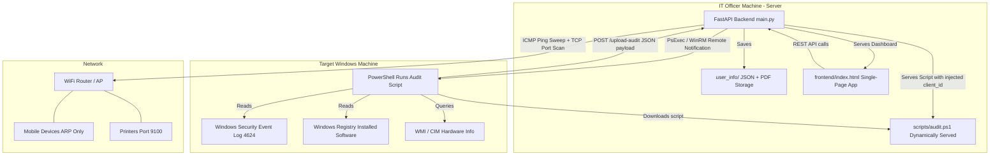
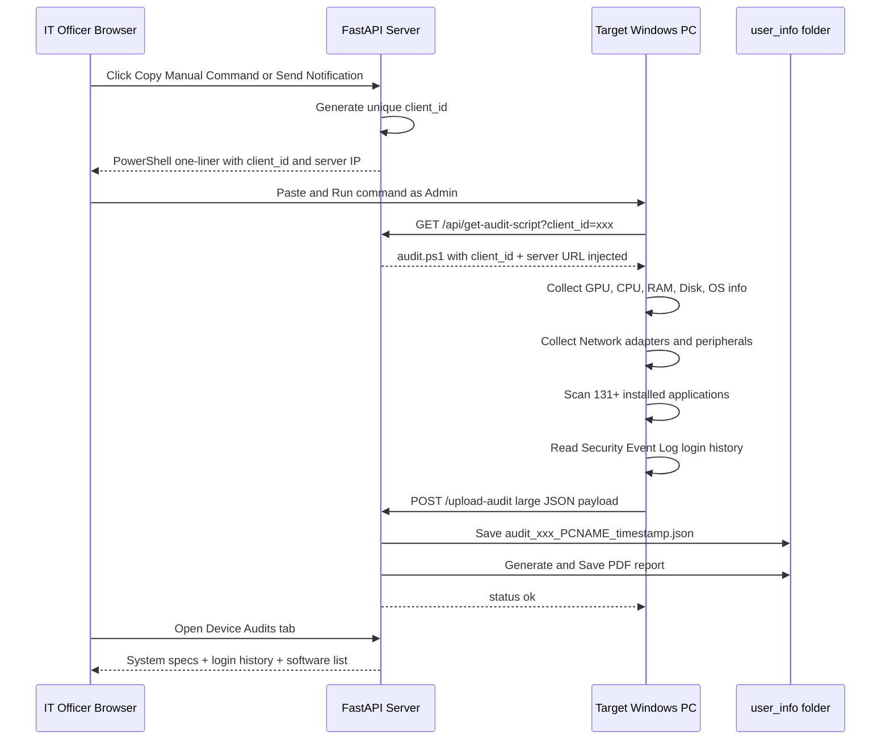
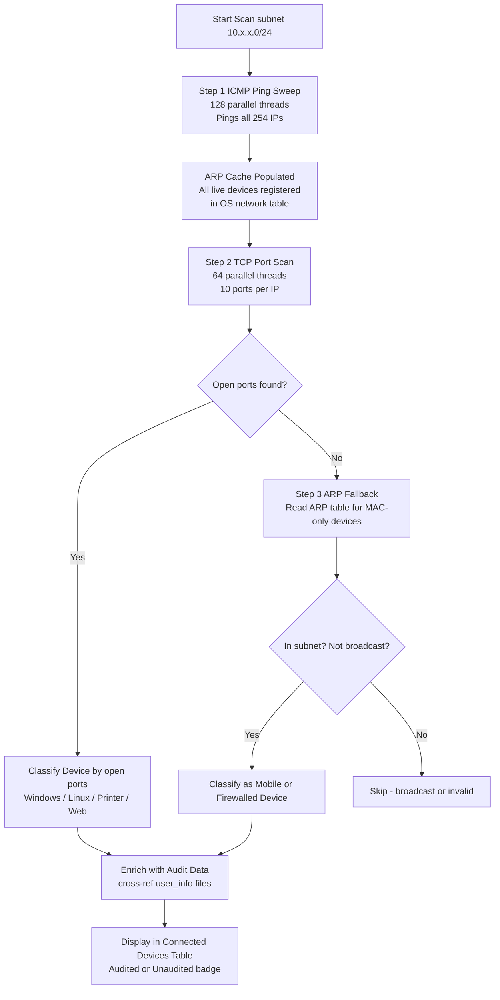
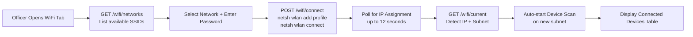
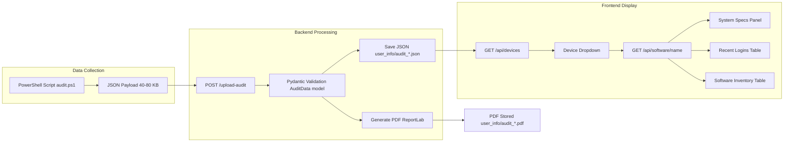

# 🛡️ NSDL IT Compliance & Asset Management Portal

> **A full-stack, agent-less IT compliance and asset management platform built for NSDL branch audits. Automatically discovers, audits, and reports on all Windows workstations across a local network — with zero manual effort on target machines.**

---

## 📋 Table of Contents

- [Overview](#overview)
- [Tech Stack](#tech-stack)mo
- [Project Structure](#project-structure)
- [Core Features](#core-features)
- [System Architecture](#system-architecture)
- [Audit Workflow](#audit-workflow)
- [Network Discovery Workflow](#network-discovery-workflow)
- [WiFi Management Workflow](#wifi-management-workflow)
- [Data Flow Diagram](#data-flow-diagram)
- [API Reference](#api-reference)
- [Setup & Running](#setup--running)
- [Security & Permissions](#security--permissions)

---

## Overview

The **NSDL IT Compliance & Asset Management Portal** is a self-hosted web application that replaces the manual, paper-based compliance audit process at NSDL branch offices.

An IT officer connects their laptop to a branch WiFi network, opens the portal in a browser, and the system:

1. **Discovers** all live devices on the subnet automatically.
2. **Identifies** Windows workstations, mobiles, printers, and unknown devices.
3. **Audits** each Windows machine — collecting hardware specs, software inventory, login history, antivirus status, hotfixes, and more.
4. **Generates** a structured PDF inspection report and JSON data file.
5. **Displays** all collected data in a rich, interactive dashboard.

---

## Tech Stack

| Layer | Technology | Purpose |
|---|---|---|
| **Backend** | Python 3 + FastAPI | REST API server, audit ingestion, network scanning |
| **Frontend** | Vanilla HTML/CSS/JS | Single-page application dashboard |
| **Report Generation** | ReportLab | PDF compliance report generation |
| **Remote Execution** | PyPsExec + PyWinRM | Remote notification delivery to target PCs |
| **Network Scanning** | Python `socket` + `subprocess` | TCP port scan + ICMP ping sweep + ARP discovery |
| **Audit Script** | PowerShell (`.ps1`) | Agentless data collection on target Windows machines |
| **Data Storage** | JSON files + PDF | Audit records stored as structured files per device |
| **Connectivity** | Windows WLAN API (`netsh`) | Programmatic WiFi network management |

---

## Project Structure

```
NSDL-Compliance-Audit-Portal/
│
├── backend/
│   ├── main.py              # FastAPI application — all API endpoints
│   └── requirements.txt     # Python dependencies
│
├── frontend/
│   └── index.html           # Single-page dashboard (HTML + CSS + JS)
│
├── scripts/
│   ├── audit.ps1            # PowerShell audit collection script (Windows)
│   └── audit.sh             # Shell audit script (Linux/Mac — legacy)
│
├── user_info/               # Audit output storage (JSON + PDF per audit)
├── logs/
│   └── audit_backend.log    # Application & scan logs
│
└── venv/                    # Python virtual environment
```

---

## Core Features

### 1. 🖥️ Device Audit (Compliance Audit Tab)

- **Agentless collection** — no software needs to be installed on target machines.
- The audit PowerShell script is **dynamically served** from the backend with the correct server IP and a unique session `client_id` pre-injected.
- On execution, the script silently collects:
  - **OS Information** — Name, version, architecture, Windows license status.
  - **Hardware Details** — CPU model, total RAM, disk drives and sizes, GPU name/VRAM/driver version, system manufacturer, model, and serial number.
  - **Network Configuration** — IP address, MAC address, subnet, gateway, all NIC adapters.
  - **Security Status** — Antivirus products detected (Windows Defender, third-party AV).
  - **Hotfixes / Windows Updates** — All installed KB patches with dates.
  - **Peripheral Devices** — USB devices, keyboards, mice, scanners, printers, Bluetooth.
  - **Disk Partitions** — All partitions, sizes, types, and boot flags.
  - **Compression Utilities** — WinZip, 7-Zip, WinRAR detection.
  - **CD/DVD Drives** — Detection of optical drives.
  - **Printers** — All connected/networked printers with driver, port, and status.
  - **User Accounts** — All local accounts with disabled/enabled status.
  - **Software Inventory** — Full list of 100–200+ installed applications with version, publisher, install date, and size.
  - **Login History** — Up to 20 most recent interactive logons from the Windows Security Event Log (requires Admin) with logon type and timestamp.
- The collected data is uploaded to the server as a **JSON payload** and saved.
- A **PDF Inspection Report** is automatically generated and saved.

---

### 2. 🗂️ Asset Registry Tab

- Manually register and track any device with:
  - Device ID / Hostname
  - Asset Tag (e.g., `NSDL-AST-2024-001`)
  - Owner / Assignee name, Department, Location / Branch
  - Purchase date, price, and warranty expiry
  - Life cycle stage (Active, Maintenance, Retired, Disposed)
  - Vendor and additional notes
- All registered assets are displayed in a sortable, filterable table.
- Supports **Edit** and **Delete** operations.
- **Export to CSV** for offline reporting.

---

### 3. 🔍 Network Discovery Tab

- **Automatic subnet detection** from the current WiFi connection.
- **Two-phase discovery engine:**
  1. **ICMP Ping Sweep** — Pings all 254 IPs in parallel (128 threads) to populate the OS ARP cache. Ensures **all** live devices are found, including mobile phones and firewalled PCs that block TCP ports.
  2. **TCP Port Scan** — Scans 10 common ports in parallel (64 threads) with configurable timeout.
- **Smart device classification** by open ports and hostname:
  - `Windows Host` (ports 135 RPC, 445 SMB, 3389 RDP)
  - `Web Service / Network Device` (ports 80/443)
  - `Linux / SSH Device` (port 22)
  - `Printer` (port 9100)
  - `Mobile / Firewalled Device` (ARP-only, no open ports)
- **ARP fallback** — Discovers any live device with all TCP ports blocked. Broadcast IPs and `ff:ff:ff:ff:ff:ff` MACs are filtered out.
- **Audit status enrichment** — Cross-references IPs/hostnames against stored audit files to show `✅ Audited` or `⚠️ Unaudited` badge.
- **Send Notification button** — Remotely delivers an IT audit notification to any Windows machine using PsExec or WinRM.
- **Copy Manual Command button** — Generates a PowerShell one-liner for manual execution on a target machine.
- Filter by IP, hostname, OS, or username. Export results to CSV.

---

### 4. 🖥️ Device Audits Tab (Hardware + Software + Logins)

- Dropdown selector populated with all audited devices from `user_info/`.
- On device selection, displays **three rich panels**:

  **Panel 1 — System Specifications:**
  - OS name and build version, CPU, RAM, Storage, Manufacturer/Model, Serial Number, Antivirus, License status badge.

  **Panel 2 — Recent Logins:**
  - Table of last 20 logins: Username, Domain, Logon Type, Timestamp.
  - Logon types: `Local Interactive`, `Cached Interactive`, `Unlock`, `Remote (RDP)`.

  **Panel 3 — Software Inventory:**
  - Full table of all installed applications.
  - Search/filter by name, publisher, or version.
  - Export to CSV.

---

### 5. 📡 WiFi Dashboard Tab

- View **available WiFi networks** with SSID, signal strength, and security type.
- **Connect** to any network directly from the browser.
- After connecting, automatically runs a **device scan** on the new subnet.
- Displays live **Connected Devices** table with audit status.

---

### 6. 📄 PDF Report Generation

- Every audit automatically generates a **professional PDF compliance report** containing:
  - Branch name, code, officer name, date, and audit timestamp.
  - Compliance summary table (OS, CD drive, printer, antivirus, compression).
  - Full hardware specification and network adapter table.
  - Complete hotfix / Windows Update list.
  - Full software inventory table.
- Reports stored as `audit_<id>_<PC name>_<timestamp>.pdf` in `user_info/`.

---

## System Architecture



---

## Audit Workflow



---

## Network Discovery Workflow



---

## WiFi Management Workflow



---

## Data Flow Diagram



---

## API Reference

| Method | Endpoint | Description |
|---|---|---|
| `GET` | `/wifi/networks` | List all available WiFi networks |
| `GET` | `/wifi/current` | Get current WiFi connection details |
| `POST` | `/wifi/connect` | Connect to a WiFi network |
| `GET` | `/wifi/scan-devices` | Scan current subnet for live devices |
| `POST` | `/discover/network-scan` | Run custom subnet port scan |
| `POST` | `/upload-audit` | Receive and store a full audit payload |
| `GET` | `/api/get-audit-script` | Serve dynamic audit.ps1 with injected client_id |
| `GET` | `/api/devices` | List all audited devices |
| `GET` | `/api/software/{computer_name}` | Get full audit data for a device |
| `POST` | `/audit/send-notification` | Remote-execute audit notification on target PC |
| `GET` | `/assets` | List all registered assets |
| `POST` | `/assets` | Create or update an asset registration |
| `DELETE` | `/assets/{device_id}` | Remove an asset |
| `GET` | `/scripts/audit.ps1` | Serve raw audit script file |
| `GET` | `/` | Serve the frontend dashboard |

---

## Setup & Running

### Prerequisites

- Python 3.10+
- Windows OS (required for WiFi and network scanning features)
- PowerShell 5.1+ on target audit machines

### Installation

```bash
# 1. Clone the repository
git clone https://github.com/Rudra-Gupta15/Prevoyance_inspection.git
cd Prevoyance_inspection

# 2. Create and activate virtual environment
python -m venv venv
venv\Scripts\activate

# 3. Install Python dependencies
pip install -r backend/requirements.txt

# 4. Start the server
uvicorn backend.main:app --host 0.0.0.0 --reload
```

### Accessing the Portal

- **Local machine:** `http://localhost:8000`
- **From any device on the same network:** `http://<your-server-ip>:8000`

### Running an Audit on a Target Machine

```powershell
# Run as Administrator on the target PC
powershell -c "Invoke-WebRequest -Uri 'http://<SERVER_IP>:8000/api/get-audit-script?client_id=manual_audit' -OutFile '$env:TEMP\audit.ps1'; & '$env:TEMP\audit.ps1'"
```

> **Tip:** Use the **Copy Manual Command** button in the WiFi Dashboard tab to auto-generate this command with the correct server IP pre-filled.

---

## Security & Permissions

| Feature | Requirement |
|---|---|
| Run audit script | Any standard user |
| Read full login history | **Administrator** on target machine |
| Send remote notification via PsExec | Admin credentials + SMB/File Sharing enabled |
| Send remote notification via WinRM | WinRM enabled on target |
| WiFi connect/disconnect | Sufficient Windows privileges on server |
| Read Security Event Log | Administrator on target machine |

### Enabling Remote Audit via PsExec

Run on the **target machine** as Administrator:

```powershell
# Allow remote administration for local accounts
New-ItemProperty -Path "HKLM:\SOFTWARE\Microsoft\Windows\CurrentVersion\Policies\System" `
    -Name "LocalAccountTokenFilterPolicy" -Value 1 -PropertyType DWord -Force

# Enable File and Printer Sharing
netsh advfirewall firewall set rule group="File and Printer Sharing" new enable=Yes
```

---

## Output Files

Every completed audit produces two files in `user_info/`:

| File | Format | Contents |
|---|---|---|
| `audit_<id>_<PC>_<timestamp>.json` | JSON | Full raw audit data — hardware, software, logins, network |
| `audit_<id>_<PC>_<timestamp>.pdf` | PDF | Formatted compliance inspection report for submission |

---

*Built for NSDL e-Governance Infrastructure Ltd. — IT Compliance & Branch Audit Operations.*
